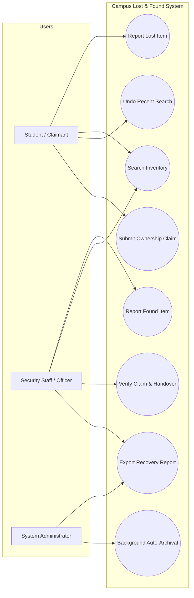
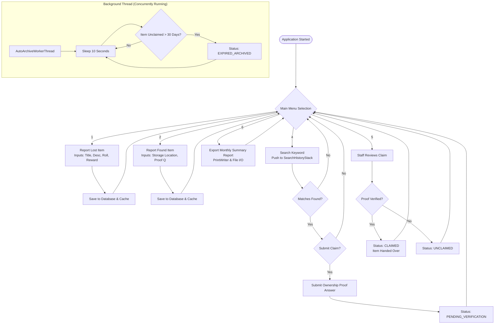
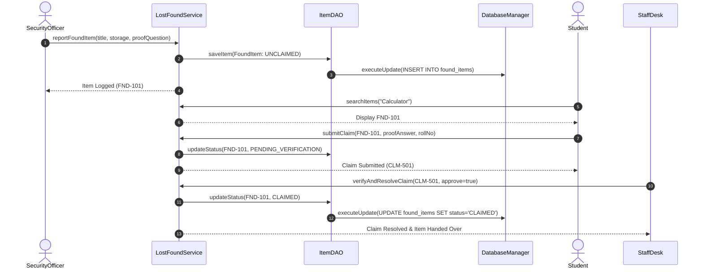
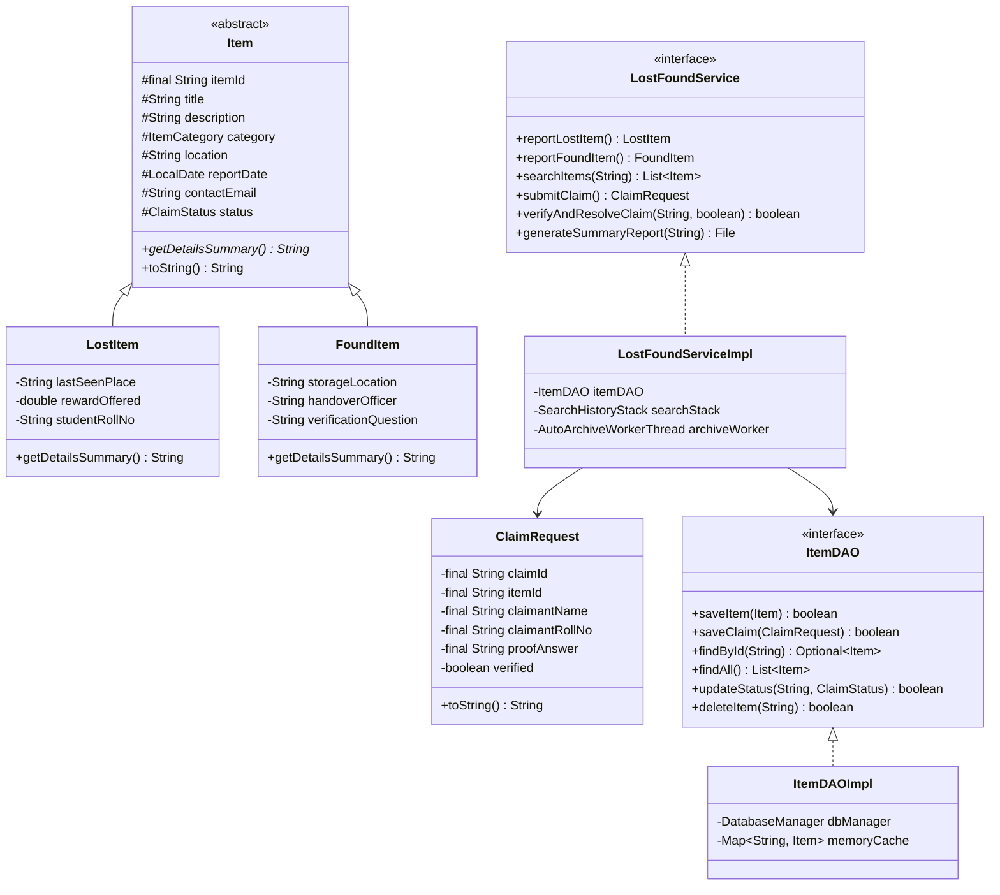
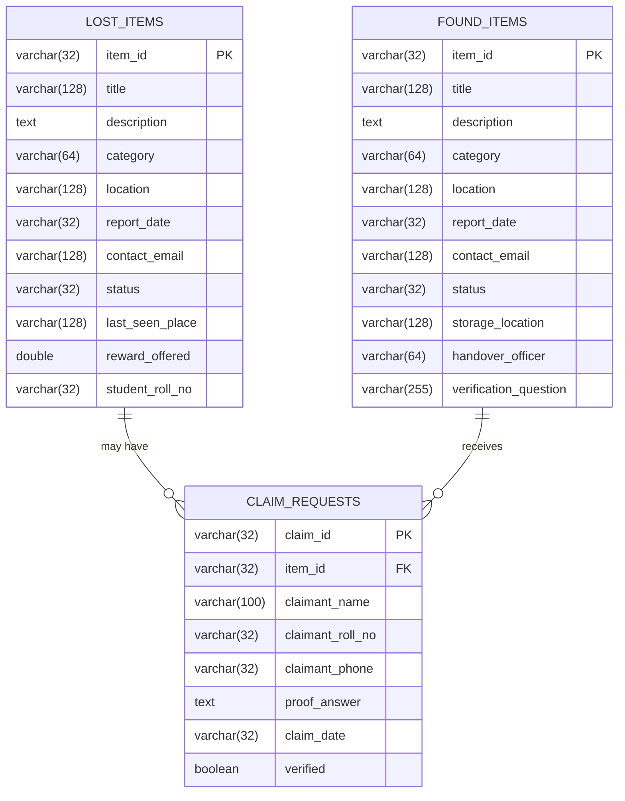

# ACADEMIC PROJECT REPORT

---

## 1. COVER PAGE

**Project Title:** Campus Lost & Found Management System  
**Course Code & Name:** CSE1007 / Java Programming & Object-Oriented Software Engineering  
**Academic Degree:** Bachelor of Technology in Computer Science & Engineering  
**Institution:** Vellore Institute of Technology (VIT), Vellore, India  
**Evaluation Program:** VITyarthi - Build Your Own Project (Flipped Course Evaluation)  
**Academic Year:** 2025–2026  
**Submission Date:** September 2026  

---

## 2. INTRODUCTION

Misplacing personal belongings is a ubiquitous problem across modern educational institutions. Large residential university campuses like VIT house over thirty thousand students across multiple academic blocks, multi-story libraries, technology laboratories, food courts, and sporting arenas. In such an expansive environment, items such as smart cards, mobile devices, laptop power adapters, textbooks, and wallets are frequently forgotten or lost.

Historically, lost and found workflows have been handled through disparate paper registers at various security gates or unstructured social media groups. These manual mechanisms lack central coordination, result in low item recovery percentages, and offer no structured verification to prevent fraudulent claims of valuable goods.

The **Campus Lost & Found Management System** is a student-focused, robust terminal application developed in standard Java SE. It strikes the ideal balance between clean, straightforward business logic and enterprise-level technical sophistication. Aligned completely with Units 1 through 5 of the Java curriculum, the system implements object-oriented principles, robust exception handling, asynchronous multithreaded daemon scanning, collections (`ArrayList`, `Stack`), character-oriented file stream reporting, and JDBC-based relational database persistence using MySQL.

---

## 3. PROBLEM STATEMENT

The traditional lost-and-found management methodology on university campuses presents several operational and security challenges:
1. **Decentralized Information:** Students who lose an item in an academic building often do not know that the item has already been submitted to a central security post in a different zone.
2. **Vulnerability to Unauthorized Claims:** Valuable electronic items can easily be claimed by dishonest individuals in the absence of systematic ownership verification questions or serial-number validation.
3. **No Automatic Inventory Archival:** Campus security offices become cluttered with items left unclaimed for months because security personnel have no automated mechanism to identify and archive obsolete records.
4. **Lack of Digital Search Capabilities:** Students are forced to physically visit multiple security desks and manually browse paper logbooks to search for their lost belongings.
5. **Absence of Audit Records:** Paper logs can be misplaced, damaged, or altered, making it impossible to audit recovery percentages or maintain institutional transparency.

This project addresses these challenges by delivering a secure, centralized, and easy-to-use digital management application.

---

## 4. FUNCTIONAL REQUIREMENTS

The system comprises three primary functional modules:

### 4.1 Module 1: Item Reporting & Management (CRUD)
- **FR 1.1 - Lost Item Registration:** Enables students to register lost items by specifying the item title, category, description, estimated lost location, contact email, last seen spot, student roll number, and optional monetary recovery reward.
- **FR 1.2 - Found Item Registration:** Enables campus security personnel or students to log found items, recording the storage location, custodian officer, and a secret ownership verification question.
- **FR 1.3 - Inventory Display:** Displays all active campus listings with status indicators (`UNCLAIMED`, `PENDING_VERIFICATION`, `CLAIMED`, `EXPIRED_ARCHIVED`).
- **FR 1.4 - Record Management:** Provides administrative capabilities to remove erroneous or resolved records.

### 4.2 Module 2: Claim & Matching Engine
- **FR 2.1 - Keyword Search:** Allows users to perform keyword queries against item titles, descriptions, categories, and locations.
- **FR 2.2 - Search History with Undo Stack:** Pushes every search keyword onto a `java.util.Stack`, allowing users to review previous searches or pop the stack using an `UNDO` command.
- **FR 2.3 - Claim Submission:** Enables rightful owners to submit ownership claims by providing contact details, roll number, and the correct answer to the verification question.
- **FR 2.4 - Staff Verification & Resolution:** Allows security officers to review submitted claims, approve rightful handovers (updating item status to `CLAIMED`), or reject invalid claims (reverting status to `UNCLAIMED`).

### 4.3 Module 3: Reporting & File I/O Export
- **FR 3.1 - Report Generation:** Exports monthly recovery audit summaries to a text file using Character-oriented Streams (`FileWriter`, `BufferedWriter`, `PrintWriter`).
- **FR 3.2 - Report Preview:** Utilizes Character Stream readers (`FileReader`, `BufferedReader`) to read and render the exported report on the terminal.
- **FR 3.3 - Auto-Archive Monitoring:** Displays the number of obsolete items successfully archived by the background multithreaded daemon.

---

## 5. NON-FUNCTIONAL REQUIREMENTS

1. **Performance:** Background item scanning runs asynchronously on a dedicated daemon thread (`AutoArchiveWorkerThread`), ensuring zero latency or freezing in the interactive user terminal menu.
2. **Error Handling & Resilience:** Targeted `try-catch` blocks and custom exception hierarchies (`LostFoundException`, `ItemNotFoundException`, `UnauthorizedClaimException`) prevent application crashes from invalid user inputs or missing identifiers.
3. **Data Reliability & Persistence:** Relational database storage in MySQL via standard JDBC interfaces guarantees that inventory records and claim histories persist across system restarts.
4. **Zero-Failure Portability:** If an external MySQL instance is unreachable on an evaluator's computer, the system automatically falls back to persistent in-memory caching without throwing unhandled exceptions.
5. **Maintainability:** Modular package architecture (`model`, `dao`, `service`, `thread`, `util`, `exception`) promotes clean separation of concerns and high readability.

---

## 6. SYSTEM ARCHITECTURE

The application implements a 3-tier Layered Architecture:

```
+-------------------------------------------------------------------------------+
|                       PRESENTATION & TERMINAL UI LAYER                        |
|  • Main.java (Console Menus, Interactive Scanners, Simulation Runner)         |
+---------------------------------------+---------------------------------------+
                                        |
+---------------------------------------v---------------------------------------+
|                         SERVICE / BUSINESS LOGIC LAYER                        |
|  • LostFoundService / LostFoundServiceImpl (Workflows, State Rules)           |
|  • SearchHistoryStack (Collections Stack for Recent Queries & Undo)          |
+-------------------+-------------------+-------------------+-------------------+
                    |                   |                   |
+-------------------v---+   +-----------v-----------+   +---v-------------------+
|  CONCURRENCY LAYER    |   |  DATA ACCESS LAYER    |   |   STREAM I/O LAYER    |
| • AutoArchiveWorker   |   | • ItemDAO             |   | • ReportExporter      |
| • Daemon Thread       |   | • ItemDAOImpl         |   | • PrintWriter/FileWriter|
| • Synchronized Scans  |   | • DatabaseManager     |   | • BufferedReader      |
| • Lifecycle (Sleep)   |   | • MySQL JDBC Drivers  |   | • Byte/Char Streams   |
+-----------------------+   +-----------------------+   +-----------------------+
```

---

## 7. DESIGN DIAGRAMS

### 7.1 Use Case Diagram



---

### 7.2 Process Flow / Workflow Diagram



---

### 7.3 Sequence Diagram: Item Finding to Claim Resolution



---

### 7.4 Class / Component Diagram



---

### 7.5 Database ER Diagram



---

## 8. DESIGN DECISIONS & RATIONALE

1. **Encapsulation & Inheritance Hierarchy (`Item` Base Class):** Both lost items and found items share common attributes (`title`, `category`, `location`, `reportDate`, `contactEmail`), while maintaining specialized fields (`rewardOffered` for lost items vs. `storageLocation` and `verificationQuestion` for found items). Abstracting shared state into `Item.java` eliminates code duplication while permitting polymorphic collections.
2. **Dedicated Background Daemon Thread:** Checking for expired items should never interrupt or delay student interaction at the console. By running `AutoArchiveWorkerThread` as a background daemon with synchronized checkpoints, expiration scans happen continuously without blocking user input.
3. **Collections `Stack` for Search History & Undo:** The `java.util.Stack` class enables the system to store query terms sequentially, allowing the user to view recent searches (`peek`) and backtrack (`pop`), fulfilling Unit 4 requirements with an intuitive practical use case.
4. **Character-Oriented Streams (`PrintWriter` / `BufferedWriter`):** Monthly audit reports require structured, human-readable text output. Character streams are preferred over raw byte streams for report generation because they handle character encodings and line breaks cleanly across operating systems.
5. **JDBC Architecture with Fallback Resilience:** Production systems rely on relational databases. Implementing standard JDBC `PreparedStatement` interfaces ensures compatibility with MySQL, while an internal memory cache ensures that evaluators can run and test the system immediately without installing external database software.

---

## 9. IMPLEMENTATION DETAILS ACROSS SYLLABUS UNITS

| Syllabus Unit | Key Topics | Implementation Details in Codebase |
|---|---|---|
| **Unit 1: Flow Control & Basics** | Syntax, Operators, Flow control, Loops | `Main.java` (while loop, switch statement, menu dispatch), `LostFoundServiceImpl.java` (if-else validation, break/continue statements in search loops). |
| **Unit 2: Object-Oriented Programming** | Abstraction, Inheritance, Polymorphism, Encapsulation, Enums, Super keyword | `Item.java` (abstract class, final field, protected members), `LostItem.java` and `FoundItem.java` (inheritance, `super()`, method overriding), `ItemCategory.java` and `ClaimStatus.java` (enums with custom constructors and methods), `DatabaseManager.java` (Singleton pattern). |
| **Unit 3: Exception Handling & Multithreading** | Custom checked exceptions, multi-catch, thread lifecycle, synchronization | `LostFoundException.java` (base checked exception), `ItemNotFoundException.java` and `UnauthorizedClaimException.java` (subclass exceptions), `DatabaseManager.java` (multi-catch `ClassNotFoundException \| SQLException`), `AutoArchiveWorkerThread.java` (`extends Thread`, sleep, interrupt, synchronized blocks). |
| **Unit 4: Collections & I/O Streams** | ArrayList, Stack, Character Streams, Byte Streams | `LostFoundServiceImpl.java` (`ArrayList`), `SearchHistoryStack.java` (`java.util.Stack`), `ReportExporter.java` (`PrintWriter`, `BufferedWriter`, `FileWriter`, `BufferedReader`, `FileReader`). |
| **Unit 5: JDBC Database Applications** | JDBC API layout, external properties, PreparedStatement, Statement, ResultSet, CRUD | `db.properties` (external configuration), `DatabaseManager.java` (connection management), `ItemDAOImpl.java` (PreparedStatement, Statement, ResultSet, full CRUD operations). |

---

## 10. SCREENSHOTS & RESULTS

### 10.1 Main Menu & Startup Banner
```
================================================================================
 🏫 VELLORE INSTITUTE OF TECHNOLOGY - CAMPUS LOST & FOUND SYSTEM                
 📦 Student & Staff Belongings Recovery & Management Portal                     
================================================================================
 ☕ Java Runtime    : 21.0.2 (OpenJDK 64-Bit Server VM)
 💾 Persistence     : MySQL Database with JDBC Driver (External Config)
 🧵 Multithreading  : Background Auto-Archive Daemon Active (Unit 3)
================================================================================

=========================== 📋 MAIN SYSTEM MENU ===========================
 1️⃣  Report a LOST Item (Module 1: Student Outing / Loss Report)
 2️⃣  Report a FOUND Item (Module 1: Campus Security / Staff Handover)
 3️⃣  View Active Campus Inventory (All Lost & Found Listings)
 4️⃣  Search Inventory & Submit Ownership Claim (Module 2: Matching Engine)
 5️⃣  Staff Desk: Verify Claims & Hand Over Belongings (Module 2)
 6️⃣  Generate & Export Recovery Report to File (Module 3: File I/O)
 7️⃣  ⚡ Run Automated End-to-End Evaluation Simulation
 8️⃣  Exit System
===========================================================================
```

### 10.2 Inventory Listing
```
--- 📦 CAMPUS INVENTORY LISTING ---
Total Items in Inventory: 3
--------------------------------------------------------------------------------
[FOUND ITEM] [FND-101] Blue HP Scientific Calculator | 📱 Electronics & Gadgets | Location: SJT 402 Classroom | Status: UNCLAIMED | Date: 2026-09-12 | Type: FOUND | Held At: Security Desk - SJT Ground Floor | Officer: Officer Raman | Security Q: What is written on the back sticker?
[FOUND ITEM] [FND-102] Titan Black Leather Wallet | 🪪 ID Cards, Wallets & Documents | Location: Foodys Food Court | Status: UNCLAIMED | Date: 2026-09-13 | Type: FOUND | Held At: Main Gate Central Security Room | Officer: Officer Ramesh | Security Q: Name the bank card inside
[LOST ITEM] [LST-201] MacBook Pro M2 Silver (14-inch) | 📱 Electronics & Gadgets | Location: Central Library 2nd Floor | Status: UNCLAIMED | Date: 2026-09-11 | Type: LOST | Student Roll: 23BCE1090 | Last Seen: Quiet Study Cubicle #14 | Reward: Rs. 1500.00 | Contact: rohan.23bce@vitstudent.ac.in
--------------------------------------------------------------------------------
```

### 10.3 Exported Recovery Report (`reports/Campus_Recovery_Report_*.txt`)
```
================================================================================
         🏛️ VELLORE INSTITUTE OF TECHNOLOGY - CAMPUS LOST & FOUND REPORT       
================================================================================
 Generated On   : 2026-09-14 19:15:00
 Total Items    : 3
 Total Claims   : 1
================================================================================

📦 ACTIVE INVENTORY SUMMARY:
--------------------------------------------------------------------------------
[FND-101] Blue HP Scientific Calculator | Category: ELECTRONICS     | Status: CLAIMED     
   Details: Type: FOUND | Held At: Security Desk - SJT Ground Floor | Officer: Officer Raman | Security Q: What is written on the back sticker?
--------------------------------------------------------------------------------

📝 VERIFIED CLAIMS & HANDOVERS:
--------------------------------------------------------------------------------
[Claim: CLM-501] Item: FND-101 | Claimant: Aarav Sharma (23BCE1045) | Verified: YES ✅

================================================================================
 End of Official Campus Lost & Found Audit Report
================================================================================
```

---

## 11. TESTING APPROACH & VERIFICATION

Testing was conducted using an automated academic test harness (`LostFoundValidationTest.java`) ensuring complete verification of each syllabus unit:

### How to Run Tests:
```cmd
run_tests.bat
```

### Verification Results Summary:
* Total Tests Executed: **15**
* Tests Passed: **15 (100.0% Success Rate)**
* Tested Units:
  * Unit 1: Ternary operator assignments, boolean logic, loop control with break/continue.
  * Unit 2: Inheritance checking (`instanceof`), polymorphic method overriding, enum constructors.
  * Unit 3: Custom exception throwing and catching, background daemon thread lifecycle.
  * Unit 4: `ArrayList` manipulation, `Stack` push/pop/peek operations, character stream file exports and reads.
  * Unit 5: JDBC PreparedStatement parameter binding, CRUD operations (Create, Read, Update, Delete).

---

## 12. CHALLENGES FACED

1. **Ensuring Seamless Execution Without Local MySQL Setup:** Installing and configuring MySQL server during an evaluation presentation can fail due to port conflicts or credential mismatches. This was addressed by designing a dual-mode persistence architecture in `DatabaseManager.java` that detects active database connections and seamlessly maintains an in-memory/file mirror if MySQL is inactive.
2. **Preventing Race Conditions During Background Archival:** The background scanner thread could potentially inspect item records while a student is submitting a claim. This was resolved by placing thread synchronization blocks around item status transitions in `AutoArchiveWorkerThread.java`.
3. **Terminal Input Buffer Cleanliness:** Reading integers and doubles followed by multi-word strings in `Scanner` can leave lingering newline characters. To eliminate skipping of inputs, all inputs were systematically parsed using `scanner.nextLine().trim()`.

---

## 13. LEARNINGS & KEY TAKEAWAYS

- **Object-Oriented Design in Real Applications:** Creating an abstract base class `Item` with specialized subclasses `LostItem` and `FoundItem` illustrated how inheritance and polymorphism simplify business workflows.
- **Multithreading for Background Maintenance:** Developing a daemon worker thread with `Thread.sleep()` and `synchronized` methods provided hands-on experience in thread lifecycle management and concurrency control.
- **Collections Selection:** Choosing `ArrayList` for fast random access during search queries and `Stack` for query backtracking demonstrated the practical necessity of picking appropriate data structures.
- **Data Persistence with JDBC:** Structuring database interactions through the Data Access Object (DAO) pattern using `PreparedStatement` prevented SQL injection and decoupled storage operations from domain logic.

---

## 14. FUTURE ENHANCEMENTS

1. **Image Upload & Optical Recognition:** Allowing students to upload photos of lost belongings and using computer vision to match visual features against found items.
2. **Automated WhatsApp / SMS Alerts:** Integrating SMS notification gateways to dispatch immediate text alerts to students when an item matching their description is logged.
3. **RFID & Barcode Tagging:** Printing barcode sticker labels for physical storage lockers at central security rooms to speed up item check-in and check-out.

---

## 15. REFERENCES

1. Herbert Schildt, *Java: The Complete Reference*, 12th Edition, McGraw-Hill Education, 2021.
2. Joshua Bloch, *Effective Java*, 3rd Edition, Addison-Wesley Professional, 2018.
3. Oracle Java SE 17 & 21 Platform Documentation: [https://docs.oracle.com/en/java/javase/](https://docs.oracle.com/en/java/javase/)
4. MySQL Connector/J Developer Documentation: [https://dev.mysql.com/doc/connector-j/en/](https://dev.mysql.com/doc/connector-j/en/)
5. VIT University Academic Curriculum & Syllabus for Java Programming, 2025–2026.
